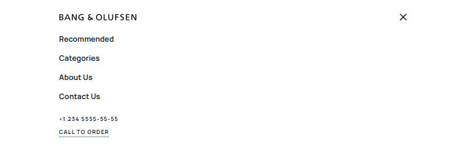

# Landing Page for Bang & Olufsen

## 📖 Project Description
This project is a responsive **landing page** for **Bang & Olufsen**, built with modern web technologies.
It focuses on delivering a smooth and stylish user experience, fully reproducing the provided design.

### ✨ Features
- **Responsive design** — optimized for phones, tablets, and desktops.
- **Pixel-perfect design** — fully matches the provided mockup.
- **Interactive elements** — hover effects, smooth scrolling, and animations.
- **Optimized performance** — lightweight and fast.
- All interface elements are functional.

--- 

  

---

## 🛠️ Technology Stack
- **HTML5**
- **CSS3**
- **Flexbox & Grid**
- **SASS / SCSS**
- **Vite**

## 🔗 Links
- [🚀 Demo Link](https://yahohulia.github.io/B.O_landing-page/)
- [🎨 Design Link](https://www.figma.com/design/DtkQmQ797hk0nI4KfMi2Uq/BOSE-New-Version?node-id=6817-211&p=f&t=joHzIdwmunqNjDHZ-0)

---

## 🚀 How to launch
Follow these steps to run the project locally:
1. Clone the repository
   ```bash
    git clone https://github.com/yahohulia/B.O_landing-page.git
    cd B.O-landing-page
2. Start project
   ```bash
    npm install
    npm run dev
