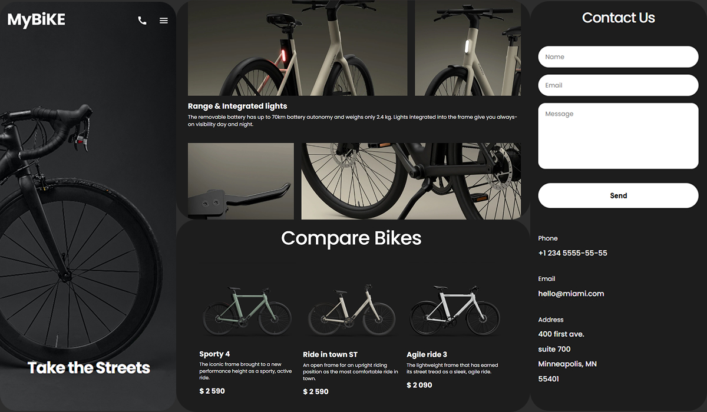

#  Landing Page

[DEMO LINK](https://slmpsk.github.io/layout_landing-page/)

Односторінковий сайт для презентації та продажу велосипедів, створений з фокусом на дизайн, адаптивність і швидкість.
Адаптивний лендінг, розроблений як частина навчального проєкту для закріплення навичок HTML, SCSS та flex/grid.

##  Використані технології

- HTML5
- SCSS (BEM)
- Flexbox / CSS Grid
- Figma (як основа дизайну)

###  Preview

##  Макет

[Посилання на макет у Figma](https://www.figma.com/design/NZQAIydtHo5QkINyGLHNcq/BIKE-New-Version?node-id=0-1&p=f&t=NPxdcuysmWeXvI2w-0))

## Додаткові інструкції для запуску
1. Клонуйте репозиторій:
git clone https://github.com/slmpsk/layout_landing-page

2. Перейдіть у папку проєкту:

cd layout_landing-page

3. Встановіть залежності:

npm install

4. Запустіть проєкт:

npm start
